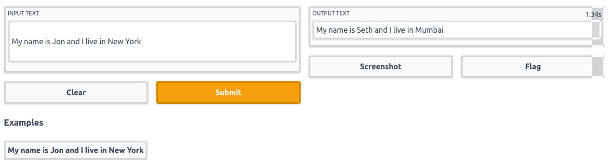

## Named entity recognition

The plan for this chapter is to:

1. Learn about named entity recognition(NER)
2. Train a transformer model for NER
3. Build a web app demo(using Gradio) around the trained model to convert a sentence from western context to Indian context. 

If you did not get the last point, here is an example to make it clear:

If we pass the sentence 'I am going to Paris' as input, the model will modify the sentence and give the output as 'I am going to Mumbai'. As you can see, the model identified the word 'Paris' and coverted it to 'Mumbai' which is more familiar to Indians. The idea for this demo is inspired from this [blog post](https://towardsdatascience.com/practical-ai-using-nlp-word-vectors-in-a-novel-way-to-solve-the-problem-of-localization-9de3e4fbf56f).

Below you can see the final demo that we will be building in this chapter:



### What is named entity recognition?

At present, there are a wide variety of tasks that machine learning models are capable of doing, named entity recognition or NER is one them. In short the job of a model trained for this task is to identify all the named entities in a given sentence.

Here is a figure showing what the model is expected to do for NER:

```{image} ./assets/ner_process.png
:alt: Named entity recignition
:class: bg-primary mb-1
:align: center
```

In the above figure, the model recognizes 'Sarah' as a person(PER) and 'London' as a location(LOC) entity. Since the other words do not belong to any category of entities, no labels are present in the output for those words.

Named entity recognition does not limit to identitfying a person, location or organization, it can also be used for identifying parts of speech of each word in a sentence. The term used to generalize these kinds of tasks is called token classification.

As humans, when we are reading a book, we understand a sentence by reading each word in that, right? Similarly, before passing a sentence into our models, we split them into simpler tokens using something called a tokenizer.

The simplest tokenizer you can think of is splitting a sentence into words as shown below:

Input sentence: ```This is looking good```

Output tokens: ```['This', 'is', 'looking', 'good']```

And here is a figure to illustrate the same:


We now have a basic understanding of the task and the related terms that we will encounter in this chapter, now let's talk about the dataset that we will be using for this task.

### Preparing the dataset

#### Downloading the dataset

We will be using the [conllpp](https://huggingface.co/datasets/conllpp) which can be directly downloaded using the huggingface datasets library using the code shown below:

```python
from datasets import load_dataset

raw_datasets = load_dataset("conllpp")
```

If we print ```raw_datasets```, we can see the structure of the dataset:


The dataset is already split into train, validation and test sets where each set has an id, tokens, pos tags, chunk tags and ner tags as features. 

Can you guess the features that we will be using for this chapter?

If you guessed it correctly, ```tokens``` and ```ner_tags``` are the only features we require for the present use case.

This is how the first 5 rows of the training dataset will look like if it were a pandas dataframe:


Now lets talk about the columns that we will be using for our task. The ```tokens``` column will be our inputs to the model and ```ner_tags``` is what the model should predict. 

#### Understanding model inputs

As you can see, the column ```tokens``` are not sentences, instead it is a list of words(which is a kind of tokenization as we discussed earlier), so from now on we can call this as pre-tokenized inputs. Even though it's already split into words, we cannot directly feed it to our model. Our model uses something called **sub-word tokenizer**, which is nothing but splitting a word into multiple subwords.

Let's take an example and make it clear:

Input sentence: ```"This is the pytorch code"```

For the above sentence, a simple tokenizer that splits a sentence into words will give the following output: ```['This', 'is', 'the', 'pytorch', 'code']```

But a sub-word tokenizer may split some words into even simpler sub-words, just like this:

```['This', 'is', 'the', 'p', '##yt', '##or', '##ch', 'code']```

As you can see, some words like pytorch which is not commonly seen in sentences are split into multiple sub-words. Also note that except for the starting token 'p', all the sub-words for the word 'pytorch' starts with a '##'.

The model that we will be using for this task is ```bert-base-cased``` which is bert model that treats cased and uncased words differently. This specific model will be helpful for our task because when writing the name of a person or a location, we always start with an upper-case letter which will make the job of our model way more easier while identifying named entities.

Now let's write some code to tokenize each row in the ```tokens``` column using the ```AutoTokenizer``` module in ```transformers``` library.

```python
from transformers import AutoTokenizer  # to tokenize the inputs

checkpoint = 'bert-base-cased'

# load tokenizer for our checkpoint
tokenizer = AutoTokenizer.from_pretrained(checkpoint)

# first row of the training set
train_row_1 = raw_datasets['train'][0]
```

Now let's pass in the ```tokens``` column of the first row into our tokenizer. Since our ```tokens``` column contain pre-tokenized inputs, we need to set the argument ```is_split_into_words``` to ```True``` while calling the tokenizer.

```python
inputs = tokenizer(train_row_1['tokens'], is_split_into_words=True)
```

If you print the ```inputs```, you can see that our tokenizer has tokenized the words(as shown below) in such a way that it contain all the information to directly feed into our transformer model.

```python
{
    'input_ids': [101, 7270, 22961, 1528, 1840, 1106, 21423, 1418, 2495, 12913, 119, 102], 'token_type_ids': [0, 0, 0, 0, 0, 0, 0, 0, 0, 0, 0, 0], 
    'attention_mask': [1, 1, 1, 1, 1, 1, 1, 1, 1, 1, 1, 1]
}
```

#### Understanding model outputs

As we've said earlier, ```ner_tags``` is the column that we will use as labels/outputs for our model. Here is the first 5 rows of this column:

```{image} ./assets/ner_tags.png
:alt: ner_tags
:class: bg-primary mb-1
:align: center
```

As you can see, it's a list of numbers. Let's see what does these numbers actually mean.

You will get all the information about each feature in the dataset using ```.features``` method. Once you filter out only the ```ner_tags``` feature from that, you will get complete information about it, just like shown below:

```python
raw_datasets['train'].features['ner_tags']
```

And you will get an output like this:

```python
Sequence(feature=ClassLabel(num_classes=9, names=['O', 'B-PER', 'I-PER', 'B-ORG', 'I-ORG', 'B-LOC', 'I-LOC', 'B-MISC', 'I-MISC'], names_file=None, id=None), length=-1, id=None)
```

Now, it's clear that there are 9 different classes/entities inside the ```ner_tags``` and the name of each label is present inside ```names```.

1. ```PER```, ```ORG```, ```LOC``` and ```MISC``` represents a person, organisation, location and miscellaneous entities respectively. The only one remaining is ```O``` which we can use to represent words that doesn't belong to any entity.

2. You might have noticed the ```B-``` and ```I-``` prefixes for these entities, those represent whether a word is at the begining or inside an entity. Let me give you an example and make it clear.

If the input is like this: ```'My name is Roy Lee and I am from New York'```

The corresponding labels should be: ```['O', 'O', 'O', 'B-PER', 'I-PER', 'O', 'O', 'O', 'O', 'B-LOC', 'I-LOC']``` where each label in the list corresponds to each word in the input sentence.

As you can see, the words 'Roy' and 'New' are the words at the begining of a person and a location, so they are given the labels as ```B-PER``` and ```B-LOC``` respectively. Whereas, the words 'Lee' and 'York' are not at the begining but inside a person and a location entity, so they are given the label ```I-PER``` and ```I-LOC``` respectively.

Lastly, all the words that does not belong to any entity is mapped to ```O``` tag.

Finally to wrap up this part, we will create a dictionary containing the id to label mapping.

```python
# store all the ner labels
labels = raw_datasets['train'].features['ner_tags'].feature.names

# number of classes/ner tags -> [0, 1, 2, 3, 4, 5, 6, 7, 8]
ids = range(len(labels))

# id to label mapping 
id2label = dict(zip(ids, labels))
```

Now we have an id to label mapping as shown below:

```
 { 
   0: 'O',
   1: 'B-PER',
   2: 'I-PER',
   3: 'B-ORG',
   4: 'I-ORG',
   5: 'B-LOC',
   6: 'I-LOC',
   7: 'B-MISC',
   8: 'I-MISC' 
 }
```

As we have an understanding of the inputs as well outputs/labels of the dataset that we are going to use, it's time to do some preprocessing and create a train, validation and test dataloader.

### Preparing the dataloader

We need to complete the following tasks before wrapping everything inside a dataloader:

1. Tokenize the inputs(```tokens``` column)
2. Align the tokens and labels

The first point is strainght forward and you must have got it. It's just tokenizing our inputs as we did earlier in this chapter. Let's talk about the second part.

Let's take the first example from our ```tokens``` column in our training set and explain this concept.

This is inputs and outputs for the first row:

Inputs: ```['EU', 'rejects', 'German', 'call', 'to', 'boycott', 'British', 'lamb', '.']```

Outputs: ```[3, 0, 7, 0, 0, 0, 7, 0, 0]```

Each word in the input list corresponds to each label in the outputs list, so, both of their lengths are the same. We cannot pass the inputs as it is because those are strings and we need to use our tokenizer and convert them to integers as we've shown earlier in the chapter. For the outputs, since they are already available as integers, we don't need to bother about them for now.

Let's tokenize the inputs and see how the tokens look.

```python
inputs = tokenizer(train_row_1['tokens'], is_split_into_words=True)

print(inputs.tokens())
```

These are the output tokens:
```
['[CLS]', 'EU', 'rejects', 'German', 'call', 'to', 'boycott', 'British', 'la', '##mb', '.', '[SEP]']
```

As you can see there are two special tokens ```[CLS]``` and ```[SEP]``` at the begining and end of the sentence, those are specific to the model that we are using. ```[CLS]``` is special token put at the start of an input sentence whereas ```[SEP]``` is used to seperate sentences.
Since we have only a single sentence ```[SEP]``` is present after the sentence ends.

Another problem is that the word 'lamb' is plit into 'la' and '##mb' by the tokenizer. Now the length of our input tokens is 12 whereas the length of the labels is 9 because our tokenizer added a ```[CLS]```, ```[SEP]``` and ```##mb``` to our inputs.

For training the model, each word should have a label assigned to it, so we need to align the tokens and labels in such a way that both their lengths are the same.

Fortunately, even after tokenization and splitting words into multiple sub-words, we could get the word ids of each token using ```.word_ids()``` method. Here is an example showing the same.

For the inputs ```['EU', 'rejects', 'German', 'call', 'to', 'boycott', 'British', 'lamb', '.']```, the word ids will be the index of the word in the list.

So, if we tokenize the above inputs using the tokenizer and take the word ids, this is what we get: ```[None, 0, 1, 2, 3, 4, 5, 6, 7, 7, 8, None]```

The two ```None``` values at the start and end represents ```[CLS]``` and ```[SEP]``` tokens. The rest of the integers represent the word ids for each token. You can clearly see that the only word id that is repeating twice is 7 which is the word id for 'lamb'. Since it's split into 'la' and '##mb', both of them have the same word ids.

Here is an illustrated diagram to make the above process clear:

```{image} ./assets/ner_word_ids.png
:alt: ner_word_ids
:class: bg-primary mb-1
:align: center
```

Now let's write a simple function to align labels with tokens. 

The function will take a list word ids and its corresponding ner labels as arguments and then the following things happen. We loop through each word id in the provided list and checks the below conditions:

1. The first condition is to check whether the current word id is not equal to the previous word id(which means that these two tokens does not belong to the same word).
2. The second condition checks whether the token is a special token which will have a word id as ```None```.
3. If the above two conditions are not satisfied(which means that the token is part of a word as well as not a special token), the last part of the rule is executed.

```python
def align_tokens_and_labels(word_ids, labels):
    previous_word_id = None
    new_labels = []
    
    for word_id in word_ids:
        
        if word_id!=previous_word_id:
            label = -100 if word_id==None else labels[word_id]
        elif word_id==None:
            label = -100
        else:
            label = labels[word_id]

            # checks if the ner label is of the form B-XXX
            if label%2==1:
                # converts the label from B-XXX to I-XXX
                label += 1
                
        previous_word_id = word_id
        new_labels.append(label)
                
    return new_labels
```

Let's test the function:

```python
ner_labels = train_row_1['ner_tags']

# tokenized inputs
inputs = tokenizer(train_row_1['tokens'], is_split_into_words=True)
word_ids = inputs.word_ids()

align_tokens_and_labels(word_ids, ner_labels)
```

Here is the output labels:
```[-100, 3, 0, 7, 0, 0, 0, 7, 0, 0, 0, -100]```

Now we can write a single function to apply this to every example in our dataset. We will pass a batch of examples from our dataset to this function and the function will loop through example in the batch and apply ```align_tokens_and_labels``` and returns the tokenized inputs and corresponding outputs/labels in the required format. 

We also truncate our tokens to a length of 512, any input example that has a length higher than this are shortened/truncated to 512. The default maximum length set inside the tokenizer is 512, so we just need to set ```truncation=True``` while tokenizing the inputs.

```{note}
We can tokenize a group of input examples together and get the word ids using indexing. 

For example, if you've tokenized 3 sentences together, you can get the word ids of the first sentence using ```inputs.word_ids(0)```.
```

```python
def prepare_inputs_and_labels(ds):
    inputs = tokenizer(ds['tokens'], truncation=True, is_split_into_words=True)
    labels_batch = ds['ner_tags']
    
    new_labels = []
    # loop through each example in the batch
    for idx, labels in enumerate(labels_batch):
        # extract the word ids using the index
        word_ids = inputs.word_ids(idx)
        new_label = align_tokens_and_labels(word_ids, labels)
        new_labels.append(new_label)
        
    inputs['labels'] = new_labels
    return inputs
```

Now let's apply this function to our dataset as below:

```python
prepared_datasets = raw_datasets.map(
    prepare_inputs_and_labels, 
    batched=True, 
    remove_columns=raw_datasets['train'].column_names
)
```

We used the ```.map``` method and set ```batched=True``` to map our function to each batch in our dataset. Our final prepared dataset will only contain the following features: ```['input_ids', 'token_type_ids', 'attention_mask', 'labels']```, all other features are removed.

Now let's wrap our datasets inside a pytorch dataloader as shown below:

```python
# to pad the inputs and labels in a batch to same size
from transformers import DataCollatorForTokenClassification
from torch.utils.data import DataLoader

batch_size = 16
collate_fn = DataCollatorForTokenClassification(tokenizer=tokenizer)

# training dataloader
train_dl = DataLoader(
    prepared_datasets['train'], 
    batch_size=batch_size, 
    shuffle=True, 
    collate_fn=collate_fn
    )

# validation dataloader
val_dl = DataLoader(
    prepared_datasets['validation'], 
    batch_size=batch_size, 
    shuffle=True, 
    collate_fn=collate_fn
    )

# test dataloader
test_dl = DataLoader(
    prepared_datasets['test'], 
    batch_size=batch_size, 
    shuffle=True, 
    collate_fn=collate_fn
    )
```

### Training the model

As our dataloaders are in place, let's discuss the steps to train our model. The steps are almost similar to the normal training loop that we use for training other models with pytorch.

First we will write the code to create the model and optimizer for our training:

```python
import torch
from torch import optim
# token classification model
from transformers import AutoModelForTokenClassification

# load the pretrained model
model = AutoModelForTokenClassification.from_pretrained(
    checkpoint, 
    num_labels=len(labels)
    )
opt = optim.AdamW(model.parameters(), lr=1.23e-4)
```

The model will be loaded and the number of units in the classification part of the model will be replaced by the value provided to ```num_labels```, which in our case will be 9. The learning rate is obtained using the this [learning rate finder](https://github.com/davidtvs/pytorch-lr-finder). I made some hacky tweaks to make it work for this specific application.

We will obviously use a GPU for training the model, so we need to move our dataloaders, model and the optimizer to it as well. We will use huggingface's ```accelerate``` library for this. If not already installed you can do it by running the command ```pip install accelerate``` from your terminal.

With ```accelerate```, moving everything to GPU is as simple as this:

```python
from accelerate import Accelerator

accelerator = Accelerator()
train_dl, val_dl, test_dl, model, opt = accelerator.prepare(
    train_dl, 
    val_dl, 
    test_dl, 
    model, 
    opt
)
```

We now need a metric to measure the performance of our model after each epoch. We will use the ```seqeval``` framework for this, using which we can get the f1-score, precision, recall and overall accuracy. You can install it by running ```pip install seqeval``` on your terminal.

For calculating the metrics, we need to pass in the predictions and corresponding labels in string format to ```seqeval```, just like shown below:

```python
from datasets import load_metric

metric = load_metric('seqeval')

targets = ['O', 'B-PER', 'I-PER', 'O', 'O', 'O']
predictions = ['O', 'B-PER', 'O', 'O', 'O', 'O']

metric.compute(predictions=[predictions], references=[targets])
```

Running the above code will return this:

```python
{'PER': {'precision': 0.0, 'recall': 0.0, 'f1': 0.0, 'number': 1},
 'overall_precision': 0.0,
 'overall_recall': 0.0,
 'overall_f1': 0.0,
 'overall_accuracy': 0.8333333333333334}
```

Of the above outputs, we will only take into account the ```overall_accuracy``` and print it after each epoch to measure the performance of our model on the validation set.

We need to the predictions and labels in string format to calculate the overall accuracy, so lets write a function to convert them from numbers to string format.

```python
def process_preds_and_labels(preds, targets):
    preds = preds.detach().cpu()
    preds = preds.argmax(dim=-1)
    targets = targets.detach().cpu()

    true_targets = [
        [labels[t.item()] for t in target if t!=-100] 
        for target in targets
        ]
    true_preds = [
        [labels[p.item()] for p, t in zip(pred, target) if t!=-100] 
        for pred, target in zip(preds, targets)
        ]

    return true_preds, true_targets
```

Now let's write a function for our training loop which takes a dataloader as input and gets the prediction from the model, calculates the loss and finally does a backward pass and steps the optimizer. For the backward pass we will use ```accelerator.backward(model.loss)``` instead of ```model.loss.backward()``` as we've used ```accelerate``` to move everything to GPU.

The output of the model will contain the logits/predictions as well as the loss and can be accessed by ```model.logits``` and ```model.loss``` respectively.

```python
def run_training_loop(train_dl):
    model.train()
    for batch in train_dl:
        opt.zero_grad()
        out = model(**batch)
        accelerator.backward(out.loss)
        opt.step()
        
        # convert target labels and predictions to string format for computing accuracy
        preds, labels = process_preds_and_labels(out.logits, batch['labels'])
        # add the target labels and predictions of this batch to seqeval
        metric.add_batch(predictions=preds, references=labels)
```

Similarly, let's write an evaluation loop as well.

```python
def run_evaluation_loop(test_dl):
    model.eval()
    with torch.no_grad():
        for batch in test_dl:
            out = model(**batch)
            
            # convert target labels and predictions to string format for computing accuracy
            preds, labels = process_preds_and_labels(out.logits, batch['labels'])
            # add the target labels and predictions of this batch to seqeval
            metric.add_batch(predictions=preds, references=labels)
```

Now let's use these functions and train our model for 3 epochs and save the model after each epoch.

```python
epochs = 3

for epoch in range(epochs):
    run_training_loop(train_dl)
    # compute training accuracy
    train_acc = metric.compute()['overall_accuracy']
    
    run_evaluation_loop(val_dl)
    # compute validation accuracy
    val_acc = metric.compute()['overall_accuracy']
    
    print(f"epoch: {epoch} train_acc: {train_acc} val_acc: {val_acc}")
    
    # save the model at the end of epoch
    torch.save(model.state_dict(), f"model-v{epoch}.pt")
```

After training for 3 epochs, these are our final results:


If you are wondering how I got that nice looking table of results, [fastprogress](https://github.com/fastai/fastprogress) is the answer for that. It's similar to the [tqdm](https://github.com/tqdm/tqdm) progress bar but I love the nicely formatted output given by fastprogress which drags me to use it. Especially, the print messages becomes a mess while training for longer number of epochs on notebooks, but fastprogress solves that for me :)

We get a similar overall accuracy on the test set as well. The below code returns all the metrics(including overall accuracy) on the test set:

```python
run_evaluation_loop(test_dl)
metric.compute()
```

### Building the demo

And finally, we've completed the training and validation of the model. Now it's time to build the gradio demo, so that everyone can use it without pressing ```Shift+Enter``` :)

As we have said in the begining of this chapter, we will build an application to covert a sentence from western context to Indian context.

For building our final application we need two more libraries - gradio and gensim(version ```4.1.2```).

So let's start building our demo. First let's import gradio(to build our app) and gensim downloader to download the ```word2vec``` embeddings. Once the embeddings are downloaded, we could use the ```.most_similar()``` method of the api to find the most similar words for the named entities recognized by our model.

As an example, for an input sentence like this: ```'My name is Sarah and I live in Columbia'```, we will get a modified sentence like this ```'My name is Amanda and I live in Delhi '``` where 'Sarah' and 'Columbia' are replaced with words that fits more into the Indian context.

```python
import gradio as gr
import gensim.downloader as api
```

Let's download the word2vec embeddings.

```python
word2vec = api.load('word2vec-google-news-300')
```

Now let's write the function that takes in a sentence containing named entities familiar to western people and return the sentence modified to Indian context. 

1. The function will split the the input sentence into words, tokenize it and pass it to the model for making the predictions. 
2. After that, we find the named entity corresponding to each word in the input sentence.
3. Then we find the word that is more related/closer to the word 'India' and farther away from the word 'USA' for all person, location and organisation entities in the sentence.
5. Then we replace these words with the one we got from ```.most_similar()``` method of word2vec and return the final text.

```python
def prepare_output(text):
    # split the sentence into lis of words
    text_split = text.split()
    # tokenize the words and return as pytorch tensors
    tokens = tokenizer(
        text_split, 
        is_split_into_words=True, 
        truncation=True, 
        return_tensors='pt'
        )

    # make predictions for each token
    preds = model(**tokens)['logits'].argmax(dim=-1)

    # find the named entity corresponding to each word
    word_label = {}
    for pred, word_id in zip(preds[0], tokens.word_ids()):
        if word_id!=None:
            label = labels[pred]
            word = text_split[word_id]
            word_label[word] = label

    out_text = ""
    for word, label in word_label.items():

        # replace PER, LOC and ORG entities with words closer to 'India'
        if label.split('-')[-1] in ['PER', 'LOC', 'ORG']:
        try:
            word = word2vec.most_similar(
                positive=['India', word], 
                negative=['USA'], topn=1
                )[0][0]
        except KeyError:
            pass
        out_text += f"{word} "
    return out_text
```

Let's test this with an example,

```python
prepare_output("My name is Mitchell and I live in Paris")
```

And here's the output:

```python
'My name is Mukherjee and I live in Delhi'
```

'Mitchell' got replaced by 'Mukherjee' and 'Paris' got replaced by 'Delhi'.

This function may not work as expected in some cases where the name of a location has two word like in 'New York'. Our function will consider 'New York' as two unrelated words and replace both of seperately instead of considering them as a single entity like below:

```python
prepare_output("My name is Mitchell and I live in New York")
```

which returns,

```python
'My name is Mukherjee and I live in Delhi Delhi'
```

We don't want this to happen, so here is a slightly modified function to consider location or organisation names as a single word(join them by a '_'), which will convert 'New York' to 'New_York' and 'San Francisco' to 'San_Francisco'.

```python
def prepare_output(text):
  text_split = text.split()
  tokens = tokenizer(text_split, is_split_into_words=True, truncation=True, return_tensors='pt')
  preds = model(**tokens)['logits'].argmax(dim=-1)

  out = {}
  last_b_tag = ""
  for p, w_id in zip(preds[0], tokens.word_ids()):
    if w_id!=None:
      label = labels[p]
      label_split = label.split('-')
      word = text_split[w_id]
      if word not in out.keys():
        if label_split[0]=='I' and label_split[-1]==last_b_tag.split('-')[-1]:
          old_key = list(out.keys())[-1]
          new_key = old_key+f" {word}"
          out.pop(old_key)
          out[new_key] = last_b_tag
        else:
          out[word] = label
          
        if (label_split[0]=='B') and (label_split[-1] in ['ORG', 'LOC']):
          last_b_tag = label

  out_text = ""
  for word, tag in out.items():
    if tag.split('-')[-1] in ['PER', 'LOC', 'ORG']:
      try:
        word = word2vec.most_similar(positive=['India', word.replace(' ', '_')], negative=['USA'], topn=1)[0][0]
      except KeyError:
        pass
    out_text += f"{word.replace('_', ' ')} "
  return out_text
```

Now it's time to launch our gradion demo, it's as simple as passing the function to be executed(here it is ```prepare_output```), the type of input(text box) and the type of output to be shown(text box) to ```gr.Interface()``` just like this:

```python
interface = gr.Interface(
    prepare_output,
    inputs=gr.inputs.Textbox(label="Input text", lines=3),
    outputs=gr.outputs.Textbox(label="Output text"),
)

# launch the demo
interface.launch()
```


And voila, we have our demo up and running!!
